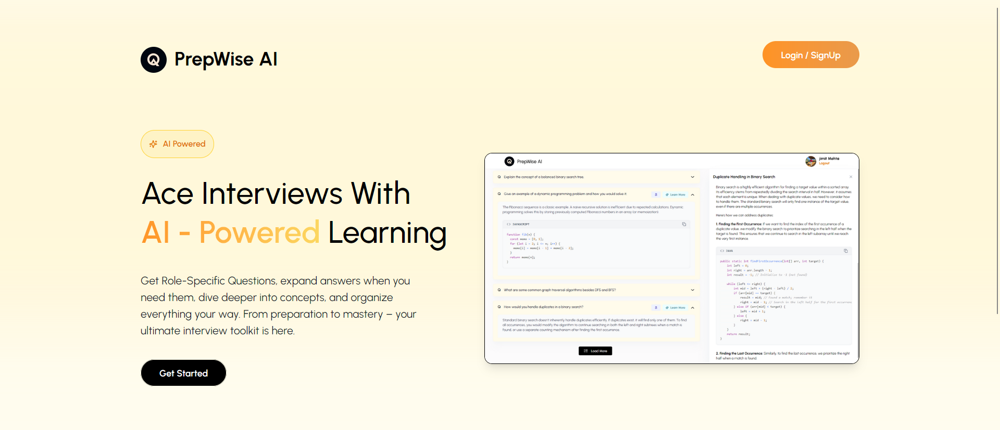
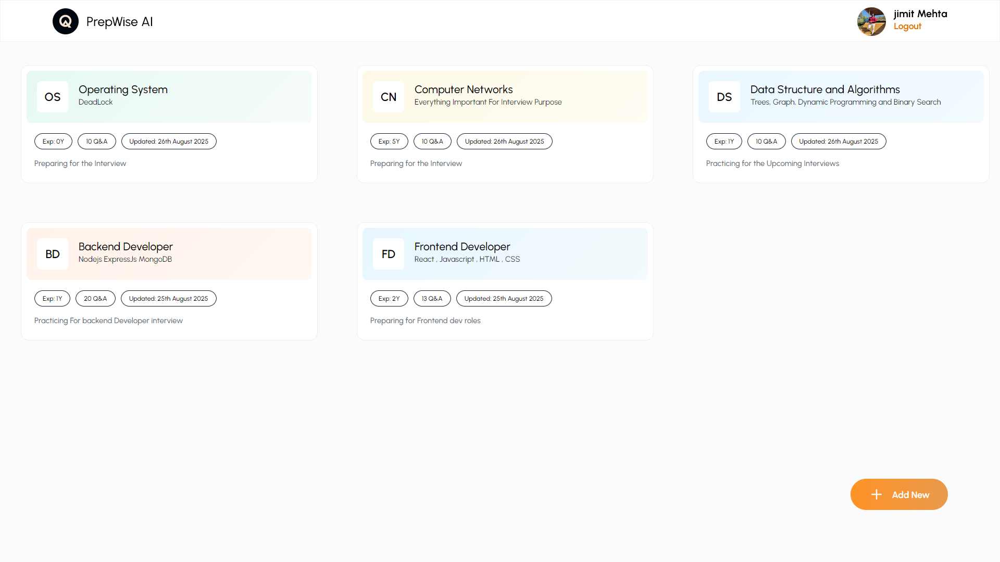
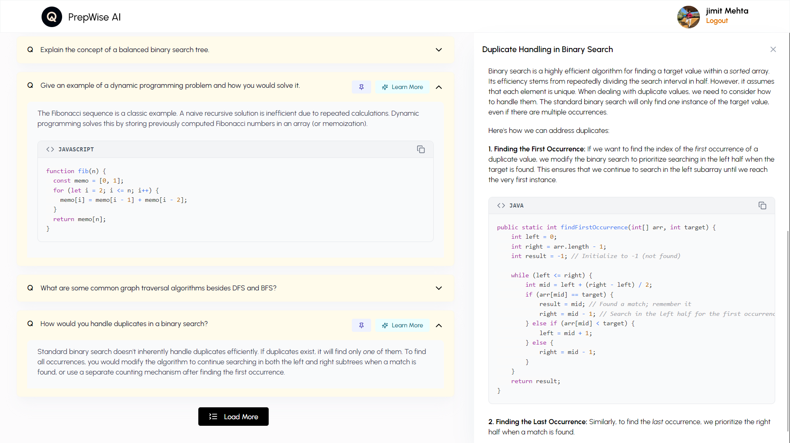

<div style="display: flex; align-items: center; justify-content: start; gap: 10px;">
  
  <h1 style="margin: 0;">PrepWise AI</h1>
</div>


A smart AI-powered interview preparation application delivers role-specific interview questions and model answers powered by Google Gemini.
Expand answers, dive deeper into concepts on demand, and pin what matters — practice smarter, interview stronger.
<p align="center">
  
</p>

## ✨ Features

- **User Authentication** - Secure JWT-based registration and login
- **Role-Based Question Generation** - Tailored questions based on job role and experience level  
- **AI-Powered Q&A** - High-quality questions and answers using Google Gemini API
- **Interactive Learning UI** - Clean accordion interface for organized study sessions
- **Dynamic AI Explanations** - On-demand concept breakdowns and detailed explanations
- **Question Pinning** - Save and organize important questions for quick review
- **Session Management** - Persistent storage of interview sessions and progress
- **Responsive Design** - Mobile-first UI with smooth animations

  <p align="center">
    
    <br/><em>Question card — Click to view answer.</em>
  </p>

  <p align="center">  <br/><em>Question & answer page with explanation panel and Pin Feature.</em> </p>

## 🛠️ Tech Stack

**Frontend**
- React.js, Tailwind CSS, Framer Motion, React Router, Axios

**Backend**  
- Node.js, Express.js, MongoDB, Mongoose, JWT, bcryptjs

**AI Integration**
- Google Gemini API

**Development**
- Vite, ESLint, Prettier

## 🚀 Getting Started

### Prerequisites
- Node.js (v14+)
- MongoDB (local or Atlas)
- Git

### Installation

1. **Clone the repository**
   ```bash
   git clone https://github.com/yourusername/prepwise-ai.git
   cd prepwise-ai
   ```

2. **Backend Setup**
   ```bash
   cd backend
   npm install
   ```

3. **Frontend Setup**
   ```bash
   cd ../frontend
   npm install
   ```

4. **Environment Variables**

   Backend `.env`:
   ```env
   PORT=5000
   MONGODB_URI=mongodb://localhost:27017/prepwise-ai
   JWT_SECRET=your-jwt-secret
   GEMINI_API_KEY=your-gemini-api-key
   ```

   Frontend `.env`:
   ```env
   VITE_API_URL=http://localhost:5000/api 
   add your backend deployed URL into frontend
   ```

5. **Start Development Servers**
   ```bash
   # Backend (from backend directory)
   npm run dev
   
   # Frontend (from frontend directory) 
   npm run dev
   ```

6. **Access Application**
   - Frontend: http://localhost:3000
   - Backend: http://localhost:5000

## 📖 Usage Guide

### Quick Start
1. **Register/Login** to create your account
2. **Create Session** by selecting your target role and experience level
3. **Generate Questions** using AI based on your preferences
4. **Study & Learn** with expandable Q&A cards and AI explanations
5. **Pin Questions** to save important ones for review
6. **Access History** to revisit previous sessions anytime

### Key Features
- **Role Selection**: Choose from Frontend, Backend, Full Stack, DevOps, etc.
- **Experience Levels**: Fresher, Junior (1-3 years), Mid (3-5 years), Senior (5+ years)
- **AI Explanations**: Click "Explain More" for deeper concept understanding
- **Question Management**: Pin/unpin questions for organized study sessions

## 👨‍💻 Author

**Jimit Mehta**
- GitHub: [@jimit8929](https://github.com/jimit8929)
- LinkedIn: [Jimit Mehta](https://www.linkedin.com/in/jimit-mehta-890745303/)
- Email: jimit8929@gmail.com

---

<div align="center">

**Made with ❤️**

⭐ Star this repo if you found it helpful!

</div>